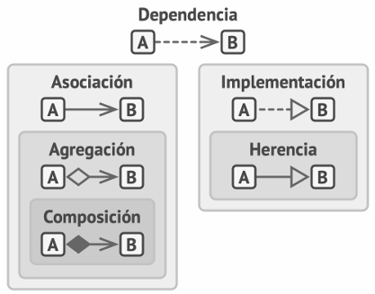

# ¿Qué es la Dependencia?

La dependencia es como una "necesidad" que tiene una clase de usar otra clase para funcionar. Es similar a cuando necesitas un lápiz para escribir - el acto de escribir "depende" del lápiz.



# Ejemplo Práctico: El Restaurante

1.  **La Cocina depende de sus Utensilios**

    - El cocinero necesita ollas para cocinar
    - ¿Por qué? Porque sin ollas, no puede realizar su trabajo
    - La clase Cocinero "depende" de la clase Olla

2.  **Sistema de Pedidos del Restaurante**

```java
// ❌ ALTA DEPENDENCIA
public class Cocinero {
    private Olla ollaEspecifica;  // Dependemos de una olla específica

    public void cocinar() {
        // Solo podemos usar esta olla específica
        ollaEspecifica.calentar();
    }
}

// ✅ BAJA DEPENDENCIA
public interface Recipiente {
    void calentar();
}

public class Cocinero {
    private Recipiente cualquierRecipiente;  // Dependemos de una interfaz

    public void cocinar() {
        // Podemos usar cualquier recipiente que implemente la interfaz
        cualquierRecipiente.calentar();
    }
}
```

# Señales de Dependencia 🚩

Las dependencias aparecen cuando en tu código:

1.  Creas objetos usando `new` de una clase específica
2.  Usas tipos concretos en los parámetros de tus métodos
3.  Llamas directamente a métodos de otras clases

```java
// Ejemplo de dependencias en código
public class ServicioRestaurante {
    // Dependencia por constructor
    private Cocinero cocinero = new Cocinero();

    // Dependencia por parámetro
    public void prepararPedido(Mesa mesaEspecifica) {
        // Dependencia por uso directo de método
        mesaEspecifica.limpiar();
    }
}
```

# La Clave 🔑

Lo más importante que debes entender es que:

- Las dependencias son necesarias, pero deben ser controladas
- Usar interfaces reduce las dependencias y hace tu código más flexible
- Mientras menos dependencias tenga tu clase, más fácil será mantenerla y probarla

# Consejo Práctico 💡

Piensa en las dependencias como "compromisos" que adquiere tu clase. Cuantos más compromisos tenga, más difícil será cambiarla en el futuro. Por eso, es mejor mantener las dependencias al mínimo necesario y hacerlas lo más flexibles posible usando interfaces.
