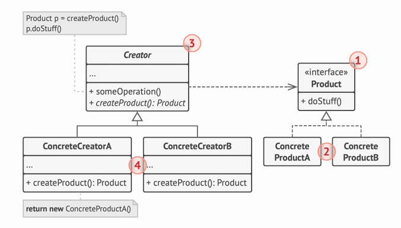

# ¿Qué es el Factory Method? 🏭

El Factory Method es como un "molde flexible" que nos permite crear diferentes tipos de objetos siguiendo una receta base, pero permitiendo que cada "cocinero" (subclase) prepare la receta a su manera.

# Ejemplo del Mundo Real: Empresa de Logística 🚛

Imagina que tienes una empresa de envíos que empezó solo con camiones, pero ahora quiere añadir barcos:

1.  **Situación Inicial**
    - Solo teníamos camiones
    - Todo el código estaba pensado para camiones
    - Los clientes piden añadir transporte marítimo
2.  **El Problema**
    - No podemos simplemente añadir barcos
    - El código está muy acoplado a la clase Camión
    - Habría que modificar TODO el código 😱

# La Solución: Factory Method 🔧

```java
// ❌ ANTES (código rígido y acoplado)
class Logistica {
    public void realizarEnvio() {
        Camion camion = new Camion();  // ¡Muy específico!
        camion.entregar();
    }
}

// ✅ DESPUÉS (usando Factory Method)
// 1. Definimos una interfaz común
interface Transporte {
    void entregar();
}

// 2. Creamos los productos concretos
class Camion implements Transporte {
    public void entregar() {
        System.out.println("Entrega por tierra");
    }
}

class Barco implements Transporte {
    public void entregar() {
        System.out.println("Entrega por mar");
    }
}

// 3. Creamos la clase creadora abstracta
abstract class Logistica {
    // Este es el Factory Method
    abstract Transporte crearTransporte();

    // Lógica de negocio
    public void realizarEnvio() {
        Transporte transporte = crearTransporte();
        transporte.entregar();
    }
}

// 4. Creamos las clases creadoras concretas
class LogisticaTerrestre extends Logistica {
    Transporte crearTransporte() {
        return new Camion();
    }
}

class LogisticaMaritima extends Logistica {
    Transporte crearTransporte() {
        return new Barco();
    }
}
```

# La Clave 🔑

Lo más importante que debes entender es que:

1.  **Flexibilidad**: Factory Method te permite añadir nuevos tipos de productos sin cambiar el código existente
2.  **Desacoplamiento**: El código que usa los productos no necesita saber las clases concretas
3.  **Extensibilidad**: Puedes añadir nuevos tipos de productos simplemente creando nuevas subclases

# Estructura del Patrón 🏗️

En la imagen del diagrama de clases podemos ver:

1.  **Product** (Interfaz): Define qué pueden hacer todos los productos
2.  **Concrete Products**: Las implementaciones específicas (Camión, Barco)
3.  **Creator** (Clase base): Contiene el Factory Method
4.  **Concrete Creators**: Las clases que deciden qué producto crear



# Consejo Práctico 💡

Usa Factory Method cuando:

- No sabes de antemano los tipos exactos de objetos que necesitarás
- Quieres que tu código sea fácil de extender con nuevos tipos de productos
- Quieres reutilizar objetos existentes en lugar de crear nuevos cada vez
