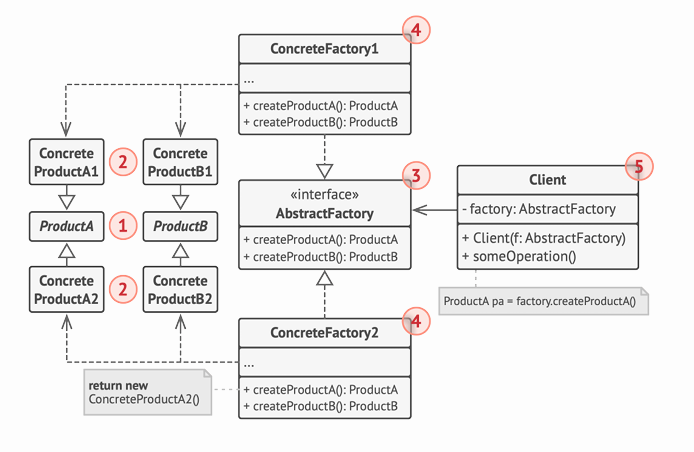

# ¿Qué es Abstract Factory? 🏭

Abstract Factory es como un "chef ejecutivo" que dirige varios restaurantes temáticos. Cada restaurante (fábrica) produce una familia completa de productos relacionados (entrada, plato principal, postre) que combinan entre sí en estilo y sabor.

# Ejemplo del Mundo Real: Tienda de Muebles 🪑

Imagina que tienes una tienda de muebles con diferentes estilos:

1.  **Situación Inicial**
    - Vendes muebles en estilos: Moderno, Victoriano y Art Decó
    - Cada estilo tiene su familia completa: sillas, sofás y mesillas
    - Los clientes quieren conjuntos que combinen perfectamente
2.  **El Problema**
    - Los clientes se molestan si los muebles no combinan
    - Necesitas asegurar que una silla moderna solo se venda con sofás y mesillas modernas
    - El catálogo cambia frecuentemente con nuevos estilos

# La Solución: Abstract Factory 🔧

```java
// 1. Productos Abstractos
interface Silla {
    void sentarse();
}

interface Sofa {
    void recostarse();
}

interface Mesilla {
    void colocarObjeto();
}

// 2. Productos Concretos
class SillaModerna implements Silla {
    public void sentarse() {
        System.out.println("Sentado en silla moderna");
    }
}

class SofaModerno implements Sofa {
    public void recostarse() {
        System.out.println("Recostado en sofá moderno");
    }
}

// 3. Fábrica Abstracta
interface FabricaMuebles {
    Silla crearSilla();
    Sofa crearSofa();
    Mesilla crearMesilla();
}

// 4. Fábricas Concretas
class FabricaMueblesModernos implements FabricaMuebles {
    public Silla crearSilla() { return new SillaModerna(); }
    public Sofa crearSofa() { return new SofaModerno(); }
    public Mesilla crearMesilla() { return new MesillaModerna(); }
}
```

# La Clave 🔑

Lo más importante que debes entender es que:

1.  **Familias de Productos**: Crea grupos completos de objetos relacionados
2.  **Consistencia**: Garantiza que todos los productos creados sean compatibles entre sí
3.  **Desacoplamiento**: El código cliente trabaja con interfaces abstractas, sin conocer las clases concretas

# Estructura del Patrón 🏗️

El diagrama muestra los componentes clave:

1.  **Productos Abstractos**: Las interfaces base (ProductA, ProductB)
2.  **Productos Concretos**: Las implementaciones específicas (ConcreteProductA1, ConcreteProductB1)
3.  **Fábrica Abstracta**: La interfaz que declara los métodos de creación
4.  **Fábricas Concretas**: Las implementaciones que crean familias específicas de productos
5.  **Cliente**: Trabaja con abstracciones, sin conocer las clases concretas



# Consejo Práctico 💡

Usa Abstract Factory cuando:

- Necesites crear familias de productos relacionados
- Quieras asegurar la compatibilidad entre los productos
- Tengas varias variantes o temas en tu aplicación (como estilos de UI, sistemas operativos, etc.)
- Necesites cambiar familias completas de productos en tiempo de ejecución
