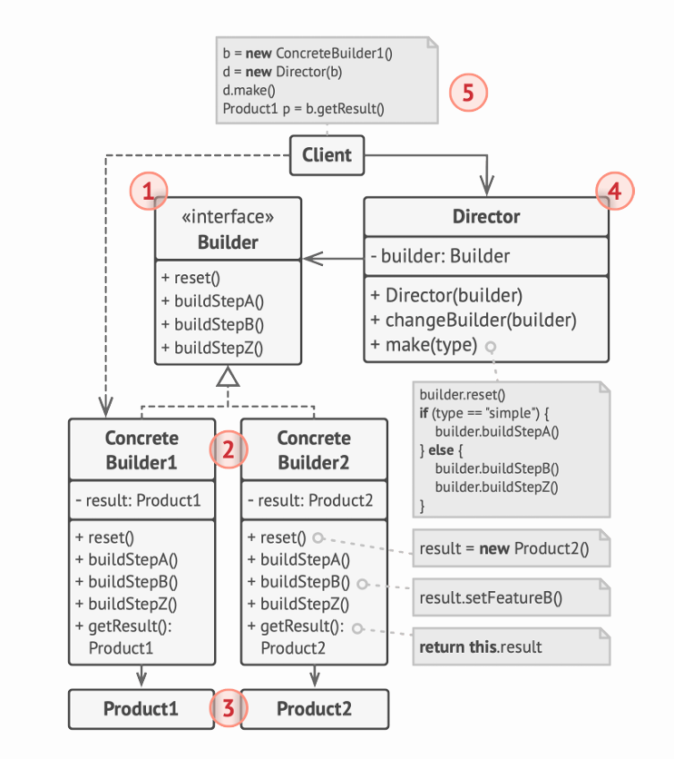

# ¿Qué es el Patrón Builder? 🏗️

El Builder es como un "chef personal" que prepara platos elaborados siguiendo una receta paso a paso, donde tú puedes decidir qué ingredientes usar y cómo combinarlos, sin tener que preocuparte por los detalles de la preparación.

# Ejemplo del Mundo Real: Construcción de Casas 🏠

Imagina que tienes una empresa constructora:

1.  **Situación Inicial**
    - Quieres construir diferentes tipos de casas
    - Cada casa tiene muchas características (paredes, puertas, ventanas, tejado...)
    - Algunas casas necesitan extras (piscina, jardín, calefacción...)
2.  **El Problema**
    - Un constructor gigante con muchos parámetros
    - Muchos parámetros quedan sin usar
    - Código difícil de mantener y entender

# La Solución: Builder Pattern 🔧

```java
// ❌ ANTES (constructor monolítico)
class Casa {
    Casa(boolean paredes, boolean puertas, boolean ventanas,
         boolean piscina, boolean jardin, boolean calefaccion) {
        // Constructor gigante y confuso 😱
    }
}

// ✅ DESPUÉS (usando Builder)
// 1. Interfaz Builder
interface CasaBuilder {
    void construirParedes();
    void construirPuertas();
    void construirVentanas();
    void construirExtras();
    Casa getResultado();
}

// 2. Builder Concreto
class CasaModernaBuilder implements CasaBuilder {
    private Casa casa = new Casa();

    public void construirParedes() {
        casa.setParedes("Cristal y Acero");
    }

    public void construirPuertas() {
        casa.setPuertas("Automáticas");
    }

    // ... otros métodos

    public Casa getResultado() {
        return casa;
    }
}

// 3. Director
class Director {
    public void construirCasaMinimalista(CasaBuilder builder) {
        builder.construirParedes();
        builder.construirPuertas();
        // Solo lo básico
    }

    public void construirCasaLujo(CasaBuilder builder) {
        builder.construirParedes();
        builder.construirPuertas();
        builder.construirVentanas();
        builder.construirExtras();
        // Todo incluido
    }
}
```

# La Clave 🔑

Lo más importante que debes entender es que:

1.  **Paso a Paso**: Construye objetos complejos de forma gradual y controlada
2.  **Flexibilidad**: Puedes crear diferentes representaciones usando el mismo proceso
3.  **Limpieza**: Evita constructores con muchos parámetros y código confuso

# Estructura del Patrón 🏗️

El diagrama muestra los componentes principales:

1.  **Builder** (Interfaz): Define los pasos de construcción
2.  **ConcreteBuilder**: Implementa los pasos para crear un producto específico
3.  **Director**: Organiza el orden de los pasos de construcción
4.  **Product**: El objeto complejo que estamos construyendo



# Consejo Práctico 💡

Usa Builder cuando:

- Necesites crear objetos complejos paso a paso
- El mismo proceso deba crear diferentes representaciones
- Quieras evitar constructores telescópicos (con muchos parámetros)
