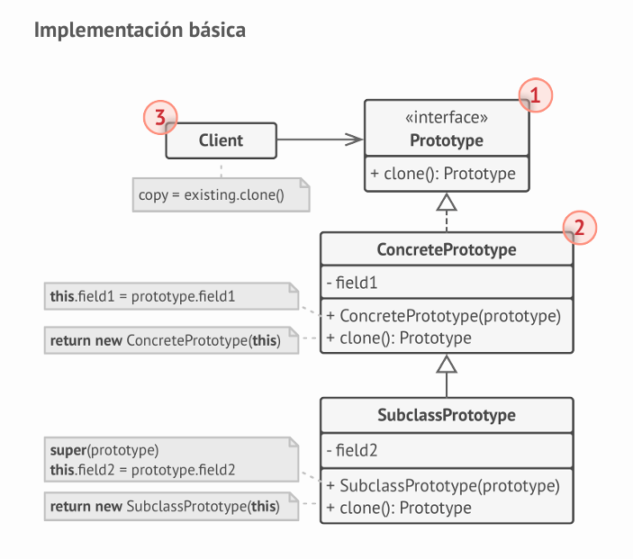
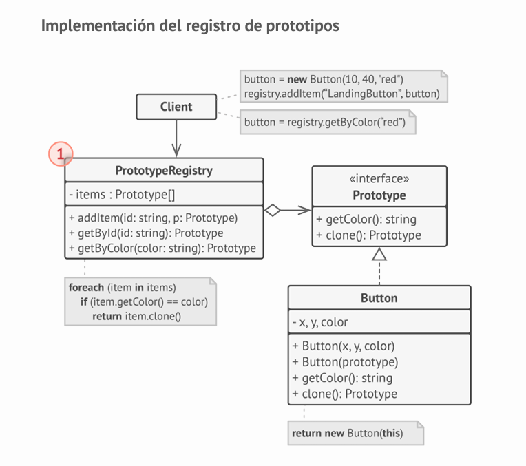

# ¿Qué es el Patrón Prototype? 🧬

El patrón Prototype es como tener una "fotocopiadora de objetos" que nos permite crear copias exactas de objetos existentes sin depender de sus clases concretas. ¡Es como la división celular en biología, donde una célula se duplica a sí misma!

# Ejemplo del Mundo Real: Sistema de Documentos 📄

Imagina que tienes una aplicación de documentos con diferentes tipos de plantillas:

1.  **Situación Inicial**
    - Tienes documentos complejos con muchas configuraciones
    - Crear cada documento desde cero es costoso
    - Necesitas variaciones de documentos similares
2.  **El Problema**
    - Crear nuevos documentos es lento y consume recursos
    - No siempre conocemos la clase exacta del objeto
    - Algunos campos son privados y no accesibles desde fuera

# La Solución: Prototype 🔧

```java
// Enfoque Directo (Problemático) ❌
class EditorGrafico {
    public Forma duplicarForma(Forma forma) {
        // ¡PROBLEMA! Necesitamos saber la clase exacta
        if (forma instanceof Circulo) {
            Circulo circulo = (Circulo) forma;
            return new Circulo(circulo.getX(), circulo.getY(), circulo.getRadio());
        }
        else if (forma instanceof Rectangulo) {
            Rectangulo rectangulo = (Rectangulo) forma;
            return new Rectangulo(rectangulo.getX(), rectangulo.getY(),
                                rectangulo.getAncho(), rectangulo.getAlto());
        }
        // ¿Y si añadimos una nueva forma? 😱
        // Habría que modificar este código
        return null;
    }
}

// Solución con Prototype (Mejor Enfoque) ✅

// Solo necesitamos conocer esta interfaz
interface Forma {
    Forma clonar();  // ¡Cada forma sabe clonarse a sí misma!
}

class Circulo implements Forma {
    private int x, y, radio;

    @Override
    public Forma clonar() {
        return new Circulo(this.x, this.y, this.radio);
    }
}

class Rectangulo implements Forma {
    private int x, y, ancho, alto;

    @Override
    public Forma clonar() {
        return new Rectangulo(this.x, this.y, this.ancho, this.alto);
    }
}

class EditorGrafico {
    public Forma duplicarForma(Forma forma) {
        // ¡MUCHO MEJOR! No necesitamos saber la clase concreta
        return forma.clonar();
    }
}
```

# La Clave 🔑

Los puntos más importantes son:

1.  **Delegación**: El objeto original es responsable de crear su propia copia
2.  **Independencia**: No necesitas conocer la clase concreta para crear copias
3.  **Eficiencia**: Evitas la inicialización costosa al clonar objetos existentes

# Estructura del Patrón 🏗️

El diagrama muestra dos implementaciones:

1.  **Implementación Básica**:
    - `Prototype`: Interfaz con método clonar()
    - `ConcretePrototype`: Implementa la clonación
    - `Client`: Usa el prototipo para crear copias



# Consejo Práctico 💡

Usa Prototype cuando:

- La creación de objetos es costosa o compleja
- Quieres reducir el número de subclases
- Necesitas ocultar la complejidad de crear objetos
- Quieres evitar repetir la inicialización de objetos similares

# ¿Qué es el Registro de Prototipos? 📚

Imagina que tienes una biblioteca de plantillas reutilizables. El Registro de Prototipos es como un "catálogo" o "biblioteca" donde guardas objetos pre-configurados listos para ser clonados.

# Ejemplo Práctico: Sistema de UI 🎨

```java
// 1. Primero, definimos nuestro registro
class PrototypeRegistry {
    private Map<String, UIComponent> items = new HashMap<>();

    // Guardar un prototipo
    public void addItem(String key, UIComponent prototype) {
        items.put(key, prototype);
    }

    // Obtener una copia de un prototipo
    public UIComponent getByName(String key) {
        UIComponent prototype = items.get(key);
        return prototype != null ? prototype.clonar() : null;
    }
}

// 2. Ejemplo de uso
class Main {
    public static void main(String[] args) {
        PrototypeRegistry registry = new PrototypeRegistry();

        // Guardamos prototipos pre-configurados
        Button botonRojoGrande = new Button(100, 50, "rojo", 20);
        Button botonAzulPequeno = new Button(60, 30, "azul", 14);

        registry.addItem("boton.rojo.grande", botonRojoGrande);
        registry.addItem("boton.azul.pequeno", botonAzulPequeno);

        // Más tarde, cuando necesitemos un botón...
        Button nuevoBoton = registry.getByName("boton.rojo.grande").clonar();
    }
}
```

# Versión Avanzada con Búsqueda por Criterios 🔍

```java
class PrototypeRegistryAvanzado {
    private List<UIComponent> items = new ArrayList<>();

    public void addItem(UIComponent prototype) {
        items.add(prototype);
    }

    // Búsqueda por múltiples criterios
    public UIComponent getByCriteria(Map<String, Object> criteria) {
        return items.stream()
            .filter(item -> matchesCriteria(item, criteria))
            .findFirst()
            .map(UIComponent::clonar)
            .orElse(null);
    }

    private boolean matchesCriteria(UIComponent item, Map<String, Object> criteria) {
        return criteria.entrySet().stream()
            .allMatch(entry -> {
                String property = entry.getKey();
                Object value = entry.getValue();

                return switch (property) {
                    case "color" -> item.getColor().equals(value);
                    case "size" -> item.getSize() == (int) value;
                    case "type" -> item.getType().equals(value);
                    default -> false;
                };
            });
    }
}

// Uso del registro avanzado
Map<String, Object> criteria = new HashMap<>();
criteria.put("color", "rojo");
criteria.put("size", 20);
criteria.put("type", "button");

Button botonEspecifico = registry.getByCriteria(criteria).clonar();
```

# Beneficios del Registro 🎁

1.  **Centralización**: Todos los prototipos en un solo lugar
2.  **Reutilización**: Evitas crear los mismos objetos una y otra vez
3.  **Mantenibilidad**: Fácil de añadir o modificar prototipos
4.  **Flexibilidad**: Puedes implementar diferentes estrategias de búsqueda

# Estructura del Patrón 🏗️

El diagrama muestra dos implementaciones:

1.  **Registro de Prototipos**:
    - Almacena prototipos comunes
    - Permite buscar y clonar por nombre o criterio
    - Útil para gestionar múltiples prototipos



# Consejo Práctico 💡

El registro es especialmente útil cuando:

- Tienes objetos que se crean frecuentemente
- La configuración de los objetos es compleja
- Necesitas mantener una "biblioteca" de objetos predefinidos
- Quieres un punto central para gestionar todos tus prototipos
